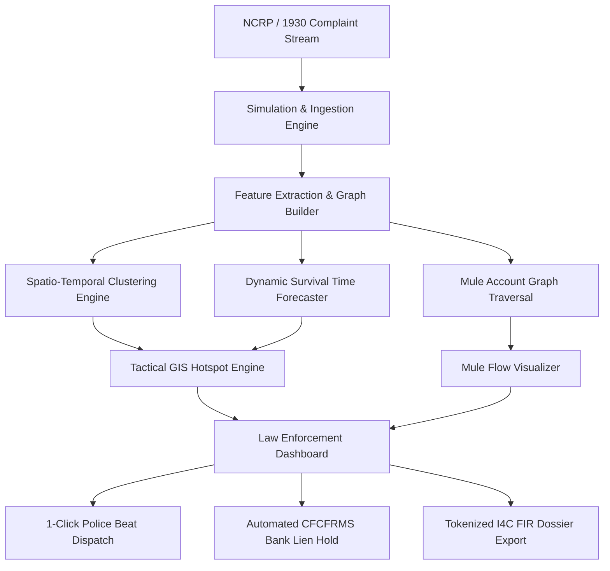

# Predictive Cybercrime Analytics and Cash-Out Preemption Framework
### Smart India Hackathon 2026 | Problem Statement ID: 26184

* **Organization:** Ministry of Home Affairs (MHA)
* **Department:** Indian Cyber Crime Coordination Centre (I4C), CIS Division
* **Theme:** Blockchain & Cybersecurity
* **Category:** Software
* **Status:** Internal Working Prototype (SIH 2026 Internal Hackathon Stage)

---

## 1. Problem Context and Overview

The National Cybercrime Reporting Portal (NCRP / 1930 Helpline) receives over 8,000 financial fraud complaints daily. In traditional cyber fraud operations, illicit funds are rapidly routed across multiple layers of mule accounts and withdrawn in physical cash at remote ATMs or Customer Service Point (CSP) kiosks within 45 to 90 minutes of initial credit.

### The Operational Challenge
Traditional cyber policing is predominantly reactive: investigations begin hours or days after complaints are registered, by which time funds have exited the formal banking system as cash.

### The Proactive Solution
This framework shifts cybercrime mitigation from post-incident investigation to proactive preemption by forecasting:
1. **Target Location (Where):** High-probability ATM/CSP cluster (latitude, longitude, 300m to 1km radius).
2. **Time Window (When):** Dynamic remaining withdrawal window (< 35 minutes) during the "Golden Hour".
3. **Actionable Intervention (Action):** Instant generation of field beat dispatch alerts and automated Citizen Financial Cyber Fraud Reporting and Management System (CFCFRMS / 1930) bank lien holds.

---

## 2. System Architecture



---

## 3. Mathematical and Algorithmic Models

### 1. Spatio-Temporal Hotspot Clustering Metric ($D_{ST}$)
Combines spatial Haversine distance with complaint time decay to isolate active withdrawal clusters:
$$D_{ST}(p_i, p_j) = \sqrt{\alpha \cdot \left(\frac{d_{Haversine}(p_i, p_j)}{\epsilon_1}\right)^2 + \beta \cdot \left(\frac{|t_i - t_j|}{\epsilon_2}\right)^2}$$

### 2. Time-to-Withdrawal Survival Function ($\hat{T}_{cashout}$)
An Accelerated Failure Time (AFT) estimator that computes the remaining minutes in the Golden Hour before physical withdrawal:
$$\hat{T}_{cashout} = T_0 \cdot \exp\left(-\left[\beta_1 \cdot \text{HopDepth} + \beta_2 \cdot \ln\left(\frac{\text{Amount}}{\Delta t_{transfer}}\right) + \beta_3 \cdot \text{DormancyScore} + \beta_4 \cdot \text{HubIndex}\right]\right)$$

### 3. Graph Fan-Out Entropy (Structuring and Smurfing Detection)
Identifies layered mule account splitting across destination nodes:
$$H_{out}(u) = -\sum_{v \in \mathcal{N}_{out}(u)} p(u \to v) \log_2 p(u \to v)$$

---

## 4. Key Capabilities of the Prototype

* **Predictive Cash-Out Forecaster:** Analyzes transaction velocity, IFSC routing paths, and geographic density to identify high-probability ATM/CSP withdrawal clusters.
* **Tactical GIS Heatmap:** Leaflet.js-powered dark tactical map displaying live ATM clusters, dynamic radar pulse rings, and regional navigation across major cyber fraud hubs (Delhi-NCR, Jamtara, Bengaluru, Mumbai).
* **Multi-Hop Mule Network Graph:** Interactive force-directed Vis.js graph mapping transaction flows from Victim to Layer-1 and Layer-2 mule accounts to the target ATM node with KYC risk indicators.
* **Real-Time 1930 Simulation Engine:** Simulates realistic Indian cyber fraud incidents (Digital Arrest, Telegram Task Fraud, Fake Stock IPO, FedEx Courier Scam, Loan App Extortion, AePS Biometric Clone).
* **Rapid Response Operations:**
  * **Dispatch Beat Patrol:** Simulates instant coordinate transmission to nearby field units.
  * **Trigger 1930 Bank Lien Freeze:** Simulates automated CFCFRMS holds to secure funds in destination accounts.
  * **Generate I4C Intelligence Docket:** Produces a structured, printable incident brief.

---

## 5. Repository Structure

```
SIH2026/
├── app/
│   ├── __init__.py
│   ├── api.py                 # FastAPI REST API endpoints and server routes
│   ├── simulation_engine.py   # Cyber fraud scenario & multi-hop mule chain generator
│   ├── predictive_engine.py   # Spatio-temporal clustering, ML risk scoring & graph traversal
│   └── static/
│       ├── index.html         # Tactical command dashboard interface
│       ├── styles.css         # Custom dark-theme CSS design system (zero-build)
│       └── app.js             # Leaflet GIS, Vis.js graph & real-time telemetry client
├── run.py                     # Single-command startup entrypoint
├── requirements.txt           # Minimal Python dependencies
├── PRESENTATION_GUIDE.md      # Slide-by-slide presentation blueprint
├── JURY_QA_MASTER_VAULT.md    # Technical, algorithmic, and legal Q&A reference
├── AGENTS.md                  # Master developer and architectural guidelines
└── README.md                  # Project overview and documentation
```

---

## 6. REST API Reference

| Method | Endpoint | Description |
| :--- | :--- | :--- |
| `GET` | `/` | Serves the tactical command dashboard (`index.html`) |
| `GET` | `/api/stats` | Returns aggregate KPIs (funds secured, imminent threats, isolated mules) |
| `GET` | `/api/incidents` | Returns filterable list of active cyber complaints |
| `GET` | `/api/incident/{id}` | Returns deep-dive telemetry and analysis for a single complaint |
| `GET` | `/api/hotspots` | Returns GeoJSON hotspot clusters with pulse radii and risk confidence |
| `GET` | `/api/mule-graph/{id}` | Returns Vis.js node and edge dataset for multi-hop money flow |
| `POST` | `/api/simulate-live` | Generates a new live cyber fraud complaint |
| `POST` | `/api/action/dispatch` | Dispatches field units to predicted coordinates |
| `POST` | `/api/action/freeze-lien`| Triggers automated CFCFRMS account hold |
| `GET` | `/api/dossier/{id}` | Generates formatted, printable I4C intelligence brief |

---

## 7. Quickstart and Setup

### Prerequisites
* Python 3.10 or higher
* Modern web browser (Chrome, Firefox, Edge, Safari)

### Installation & Run

1. Clone the repository and navigate to the project directory:
   ```bash
   cd SIH2026
   ```

2. Install dependencies:
   ```bash
   pip install -r requirements.txt
   ```

3. Start the application:
   ```bash
   python3 run.py
   ```
   *Alternatively, start using Uvicorn directly:*
   ```bash
   python3 -m uvicorn app.api:app --reload --port 8000
   ```

4. Open the dashboard in your browser:
   **[http://127.0.0.1:8000](http://127.0.0.1:8000)**

---

## 8. Demonstration Workflow (Internal Testing)

1. **Launch Dashboard:** Start the application and verify high-level aggregate KPIs on the top summary cards.
2. **Review Incoming Stream:** Observe active 1930 complaints on the left telemetry feed, noting the dynamic "Golden Hour" cashout countdown timer.
3. **Inspect Predicted Hotspots:** Click on hotspot regions (Delhi-NCR, Jamtara, Bengaluru) and select pulse rings to review predicted ATM locations and risk confidence scores.
4. **Analyze Mule Trail:** Switch to the Multi-Hop Mule Money Trail view to inspect the node graph showing fund distribution from victim to layered mule accounts.
5. **Simulate Live Ingestion:** Click "Ingest Live Incident (Simulate)" at the top right to verify real-time processing and dynamic risk calculation.
6. **Execute Preemption Actions:** Trigger "Dispatch Beat Patrol" and "Trigger 1930 Bank Lien Freeze", then open the "Official I4C FIR Docket" to verify end-to-end operational execution.

---

## 9. Data Privacy and Legal Compliance

* **DPDP Act 2023 Compliance:** All account numbers and personally identifiable information (PII) are masked using tokenization formats (`XXXX-XXXX-1234`) to prevent sensitive data exposure.
* **Audit Trail:** All simulation actions (dispatch logs, lien freezes) generate immutable transaction references for verification.
* **Zero-Build Frontend:** Built entirely with Vanilla HTML5, CSS3, and JavaScript, requiring no external build tools or node package managers.
